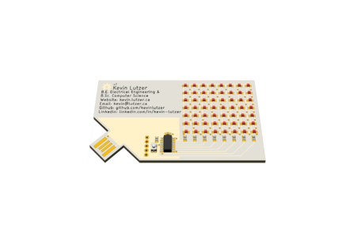
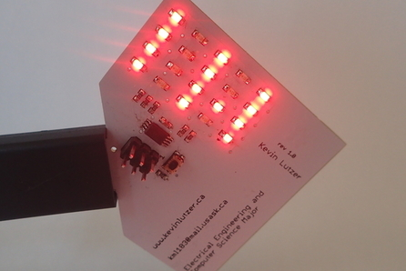

## V4

I added a faducial to the PCB to aid in some experiments I will be running with a pick and place machine. I also swapped out the programming header to use a Tag Connect TC2030 connector footprint. This removes the need for a 0.1 inch programming header or a custom programming PCB. I also switched the design to use a STM32G series process that has an arm core in it. 

## V2

I redesigned the device to use a 7x8 display, this required a larger ATMEL processor as I needed 8 pins to drive the display. Bellow is an image demonstrating what it looks like: 

## V1 

The first prototype of this device came in late 2016, early 2017. The image of it operating is below. One of the main problems with this version is that I wasn't able to incorporate the standard 7 bit dot matrix alphabet, so I had to make my own. The result was a display that was hard to read. 

