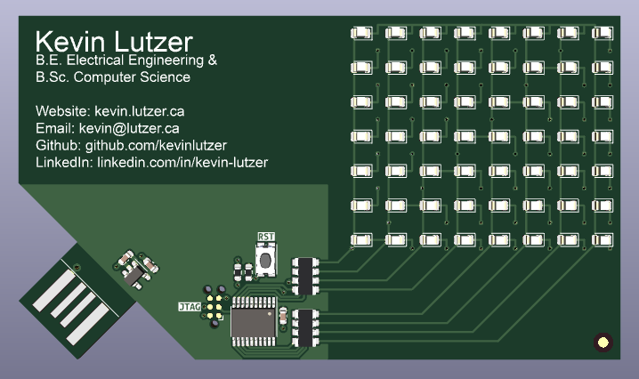

# Electronic Business Card 

The purpose of this project was to demonstrate some of my skills as an Electrical Engineer to potential employers. This project required me to build and prototype a tri-state circuit, add controls with a STM32G ARM microcontroller and design/manufacture a custom printed circuit board. When you plug the device into a standard USB2A port it scrolls my portfolio website's URL across the matrix display. I designed this device to cost about $2.50 CAD per populated board. 

This idea was inspired by a piece of advice that Dave Jones, the owner of the [EEVblog](https://www.eevblog.com/) gave. He suggests that engineers should be bringing something to an interview to show that they can actually design and build things. I sent a later version of this project to Dave Jones with a programmer PCB which he opened on a [Mailbag Segment](https://youtu.be/45C6HFf2kIA?si=SCQMgJs3VvQc_wUq&t=3084). 

Currently I am using the project as a way to test and calibrate a pick and place machine. 

